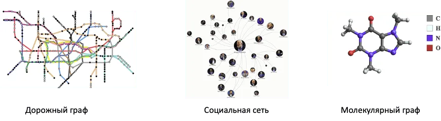
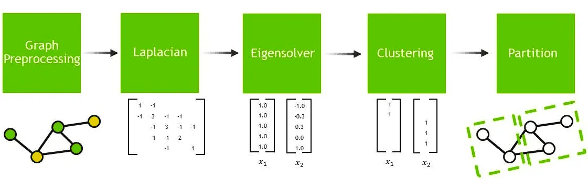
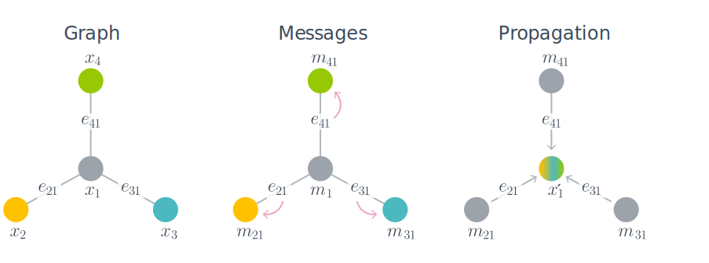

# Графовые нейронные сети

## Введение

Графовая нейронная сеть (Graph Neural Network, GNN) - тип нейронной сети, который напрямую работает со структурой графа. Этой структурой могут описываться самые разнородные данные: социальная сеть, маршруты, молекулы и т.д.

Существует 3 основных уровня задач GNN:
1. Уровень узлов: классификация узлов, предсказания признаков узлов, кластеризация узлов;
2. Уровень рёбер: классификация рёбер, предсказания связей (существования рёбер), анализ влияния рёбер;
3. Уровень целого графа: классификация графов, регрессия для графов, поиск похожих графов;

В данном репоззитории исследуется задача классификации узлов. Эта задача, где GNN предсказывает метку (label) отдельного узла на основе его признаков (features) и структуры графа.

Основная цель этого проекта это рассмотреть две разных парадигмы построения графовых свёрток (пространственная и спектральная), определить какую из них использовать в каком случае и получить первый опыт построения простейших графовых нейронных сетей.

## Парадигмы

### Спектральная парадигма

Модель спектральной парадигмы использует спектральные свойства графа, анализируя Лапласиан. Этот метод снижает вычислительную сложность, избегая вычисления собственных векторов изначальных матриц. 

### Пространственная парадигма

Модель пространственной парадигмы напрямую взаимодействует со структурой графа, основывая операции свёртки на локальном соседстве узлов. Такие модели имеют в себе стадии передачи сообщений (message passing) и обобщения (readout). Механизм передачи состояний (message-passing) обновляет скрытое представление узла основополагаясь на состояних соседних узлов. Readout фаза вычисляет вектор признаков для всего графа.

### Мини-заключение

Спектральные алгоритмы предлагают математически строгий подход, основанный на собственных значениях и собственных векторах лапласиана, тогда как пространственные алгоритмы обеспечивают более интуитивный и локально ориентированный метод. Оба подхода обладают уникальными преимуществами и могут дополнять друг друга для достижения оптимальной производительности при решении задач оптимизации потокораспределения.

## Датасет

В качестве датасета используется набор данных Cora, который представляет собой граф цитирования, где узлы соответствуют документам. Каждый узел описывается 1433-мерным вектором признаков, основанным на bag-of-words. Два документа соединены ребром, если между ними существует ссылка на цитирование. Задача заключается в предсказании категории каждого документа (всего 7 категорий).

## Результаты работы

| Модель         | Точность | Время обучения |
|----------------|----------|----------------|
| MLP (baseline) | 57%      | -              |
| GCN (spectral) | 80%      | -              |
| GAT (spatial)  | 80%      | -              |

## Заключение

В ходе данной работы была выполнена классификация узлов датасета Cora используя три разных модели. Лучшей моделью оказалась модель спектральной парадигмы - Graph Convolution Network.

